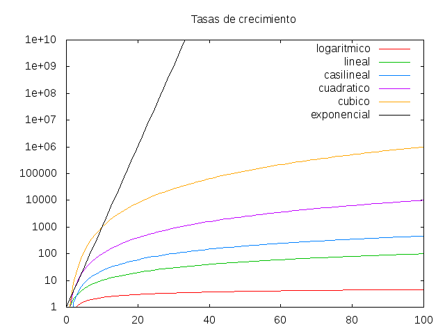
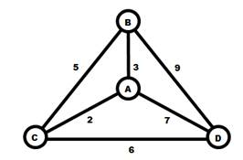

# Algoritmos

## ¿Qué es un algoritmo?

De manera sencilla e informal, digamos que un algoritmo es una secuencia finita de instrucciones o pasos definidos de manera clara y que se siguen para realizar una tarea o resolver un problema dado. 

Todo algoritmo debe ser:

- Preciso: Sin cabida a ambigüedades.
- Determinista: Debe responder de la misma manera ante las mismas condiciones.
- Finito: En algún momento, el algoritmo debe terminar.

Además de todo esto, es deseable que un algoritmo sea **eficiente.**

¿A qué nos referimos con **eficiente**? 

Diremos que entre menos recursos utilice el algoritmo (tiempo de procesamiento y espacio de memoria), más eficiente será.

## Complejidad algorítmica

La complejidad algorítmica representa la cantidad de recursos (usualmente temporales pero también espaciales, es decir espacio en memoria) que un algoritmo necesita para lograr resolver un problema. ¡Nos cuenta acerca de su eficiencia!

Se tendrá un enfoque centrado en la eficiencia temporal y se denotará a ésta por T(n).

De ahora en adelante diremos que el tiempo empleado por un algoritmo se mide en pasos.

Ideas a mantener en mente:

- Si el tamaño de los datos es lo suficientemente grande, lo que importa es el comportamiento asintótico de la eficiencia.
- La eficiencia puede obtenerse “contando” las operaciones que realiza la computadora.
- Las complejidades algorítmicas más comunes son:
    - T(n) = O( 1 ) 
    - T(n) = O( n )
    - T(n) = O( n log(n) )
    - T(n) = O( n² )
    - T(n) = O( 2^n )
    - T(n) = O( n! )

Los comportamientos de algunas de estas complejidades se describen gráficamente a continuación.

¿Qué significa esto? Sintámoslo en las entrañas…

**Problema del agente viajero**

## Conclusión:

La complejidad algorítmica es importante.